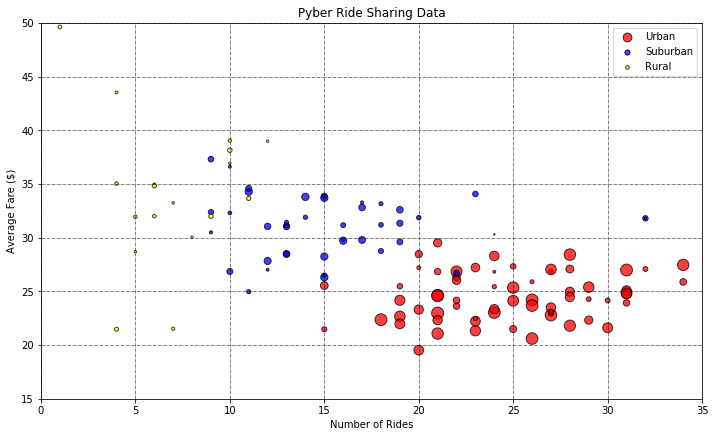
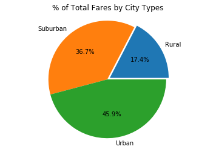
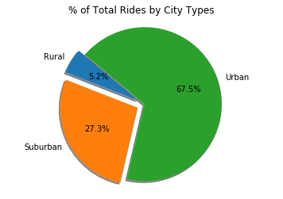
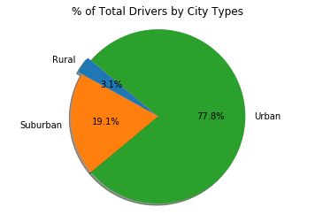

```python
import pandas as pd
import numpy as np
import matplotlib.pyplot as plt
import os
```


```python
file1=os.path.join("raw_data","city_data.csv")
file2=os.path.join("raw_data","ride_data.csv")
df_citydata=pd.read_csv(file1)
df_ridedata=pd.read_csv(file2)
```


```python
df_citydata.head()
```


<div>
<style scoped>
    .dataframe tbody tr th:only-of-type {
        vertical-align: middle;
    }

    .dataframe tbody tr th {
        vertical-align: top;
    }

    .dataframe thead th {
        text-align: right;
    }
</style>
<table border="1" class="dataframe">
  <thead>
    <tr style="text-align: right;">
      <th></th>
      <th>city</th>
      <th>driver_count</th>
      <th>type</th>
    </tr>
  </thead>
  <tbody>
    <tr>
      <th>0</th>
      <td>Kelseyland</td>
      <td>63</td>
      <td>Urban</td>
    </tr>
    <tr>
      <th>1</th>
      <td>Nguyenbury</td>
      <td>8</td>
      <td>Urban</td>
    </tr>
    <tr>
      <th>2</th>
      <td>East Douglas</td>
      <td>12</td>
      <td>Urban</td>
    </tr>
    <tr>
      <th>3</th>
      <td>West Dawnfurt</td>
      <td>34</td>
      <td>Urban</td>
    </tr>
    <tr>
      <th>4</th>
      <td>Rodriguezburgh</td>
      <td>52</td>
      <td>Urban</td>
    </tr>
  </tbody>
</table>
</div>


```python
df_ridedata.head()
```


<div>
<style scoped>
    .dataframe tbody tr th:only-of-type {
        vertical-align: middle;
    }

    .dataframe tbody tr th {
        vertical-align: top;
    }

    .dataframe thead th {
        text-align: right;
    }
</style>
<table border="1" class="dataframe">
  <thead>
    <tr style="text-align: right;">
      <th></th>
      <th>city</th>
      <th>date</th>
      <th>fare</th>
      <th>ride_id</th>
    </tr>
  </thead>
  <tbody>
    <tr>
      <th>0</th>
      <td>Sarabury</td>
      <td>2016-01-16 13:49:27</td>
      <td>38.35</td>
      <td>5403689035038</td>
    </tr>
    <tr>
      <th>1</th>
      <td>South Roy</td>
      <td>2016-01-02 18:42:34</td>
      <td>17.49</td>
      <td>4036272335942</td>
    </tr>
    <tr>
      <th>2</th>
      <td>Wiseborough</td>
      <td>2016-01-21 17:35:29</td>
      <td>44.18</td>
      <td>3645042422587</td>
    </tr>
    <tr>
      <th>3</th>
      <td>Spencertown</td>
      <td>2016-07-31 14:53:22</td>
      <td>6.87</td>
      <td>2242596575892</td>
    </tr>
    <tr>
      <th>4</th>
      <td>Nguyenbury</td>
      <td>2016-07-09 04:42:44</td>
      <td>6.28</td>
      <td>1543057793673</td>
    </tr>
  </tbody>
</table>
</div>


```python
grped_ridedata=df_ridedata.groupby('city')
city_ridedata=grped_ridedata['fare'].agg([np.size,np.mean])
city_ridedata1=city_ridedata.reset_index(drop=False)
```


```python
city_ridedata1.head()
```


<div>
<style scoped>
    .dataframe tbody tr th:only-of-type {
        vertical-align: middle;
    }

    .dataframe tbody tr th {
        vertical-align: top;
    }

    .dataframe thead th {
        text-align: right;
    }
</style>
<table border="1" class="dataframe">
  <thead>
    <tr style="text-align: right;">
      <th></th>
      <th>city</th>
      <th>size</th>
      <th>mean</th>
    </tr>
  </thead>
  <tbody>
    <tr>
      <th>0</th>
      <td>Alvarezhaven</td>
      <td>31.0</td>
      <td>23.928710</td>
    </tr>
    <tr>
      <th>1</th>
      <td>Alyssaberg</td>
      <td>26.0</td>
      <td>20.609615</td>
    </tr>
    <tr>
      <th>2</th>
      <td>Anitamouth</td>
      <td>9.0</td>
      <td>37.315556</td>
    </tr>
    <tr>
      <th>3</th>
      <td>Antoniomouth</td>
      <td>22.0</td>
      <td>23.625000</td>
    </tr>
    <tr>
      <th>4</th>
      <td>Aprilchester</td>
      <td>19.0</td>
      <td>21.981579</td>
    </tr>
  </tbody>
</table>
</div>


```python
merged_ridedata=pd.merge(df_citydata,city_ridedata1,on="city",how="inner")
merged_ridedata1=merged_ridedata.rename(columns={"size":"Number of Rides","mean":"Average Fare"})
merged_ridedata1.head()
```


<div>
<style scoped>
    .dataframe tbody tr th:only-of-type {
        vertical-align: middle;
    }

    .dataframe tbody tr th {
        vertical-align: top;
    }

    .dataframe thead th {
        text-align: right;
    }
</style>
<table border="1" class="dataframe">
  <thead>
    <tr style="text-align: right;">
      <th></th>
      <th>city</th>
      <th>driver_count</th>
      <th>type</th>
      <th>Number of Rides</th>
      <th>Average Fare</th>
    </tr>
  </thead>
  <tbody>
    <tr>
      <th>0</th>
      <td>Kelseyland</td>
      <td>63</td>
      <td>Urban</td>
      <td>28.0</td>
      <td>21.806429</td>
    </tr>
    <tr>
      <th>1</th>
      <td>Nguyenbury</td>
      <td>8</td>
      <td>Urban</td>
      <td>26.0</td>
      <td>25.899615</td>
    </tr>
    <tr>
      <th>2</th>
      <td>East Douglas</td>
      <td>12</td>
      <td>Urban</td>
      <td>22.0</td>
      <td>26.169091</td>
    </tr>
    <tr>
      <th>3</th>
      <td>West Dawnfurt</td>
      <td>34</td>
      <td>Urban</td>
      <td>29.0</td>
      <td>22.330345</td>
    </tr>
    <tr>
      <th>4</th>
      <td>Rodriguezburgh</td>
      <td>52</td>
      <td>Urban</td>
      <td>23.0</td>
      <td>21.332609</td>
    </tr>
  </tbody>
</table>
</div>


```python
grped_ridedata=merged_ridedata1.groupby('type')
urban_ridedata=grped_ridedata.get_group('Urban')
suburban_ridedata=grped_ridedata.get_group('Suburban')
rural_ridedata=grped_ridedata.get_group('Rural')
rural_ridedata.head()
```


<div>
<style scoped>
    .dataframe tbody tr th:only-of-type {
        vertical-align: middle;
    }

    .dataframe tbody tr th {
        vertical-align: top;
    }

    .dataframe thead th {
        text-align: right;
    }
</style>
<table border="1" class="dataframe">
  <thead>
    <tr style="text-align: right;">
      <th></th>
      <th>city</th>
      <th>driver_count</th>
      <th>type</th>
      <th>Number of Rides</th>
      <th>Average Fare</th>
    </tr>
  </thead>
  <tbody>
    <tr>
      <th>108</th>
      <td>South Elizabethmouth</td>
      <td>3</td>
      <td>Rural</td>
      <td>5.0</td>
      <td>28.698000</td>
    </tr>
    <tr>
      <th>109</th>
      <td>East Troybury</td>
      <td>3</td>
      <td>Rural</td>
      <td>7.0</td>
      <td>33.244286</td>
    </tr>
    <tr>
      <th>110</th>
      <td>Kinghaven</td>
      <td>3</td>
      <td>Rural</td>
      <td>6.0</td>
      <td>34.980000</td>
    </tr>
    <tr>
      <th>111</th>
      <td>New Johnbury</td>
      <td>6</td>
      <td>Rural</td>
      <td>4.0</td>
      <td>35.042500</td>
    </tr>
    <tr>
      <th>112</th>
      <td>Erikport</td>
      <td>3</td>
      <td>Rural</td>
      <td>8.0</td>
      <td>30.043750</td>
    </tr>
  </tbody>
</table>
</div>


# Pyber Ride Sharing Data


```python
# size=urban_ridedata['driver_count']

ax1=urban_ridedata.plot(kind="scatter",x="Number of Rides",y="Average Fare",marker="o",color="red",edgecolors="black",
                   figsize=(10,6),s=urban_ridedata['driver_count']*2, alpha=0.75,label="Urban")
ax2=suburban_ridedata.plot(kind="scatter",x="Number of Rides",y="Average Fare",marker="o",color="blue",edgecolors="black",
                   s=suburban_ridedata['driver_count']*2, alpha=0.75,label="Suburban",ax=ax1)
ax3=rural_ridedata.plot(kind="scatter",x="Number of Rides",y="Average Fare",marker="o",color="yellow",edgecolors="black",
                   s=rural_ridedata['driver_count']*2, alpha=0.75,label="Rural",ax=ax1)
plt.ylabel('Average Fare ($)')
# plt.figure(figsize=(20,20))
plt.tight_layout()
plt.grid(linestyle='-.',linewidth=0.5,color="black")
plt.xlim(0,35)
plt.ylim(15,50)
plt.title('Pyber Ride Sharing Data')
```


    Text(0.5,1,'Pyber Ride Sharing Data')





# Observations:
1. Urban cities have higher number of rides and the average fare is smaller than suburban and rural cities.
2. Rural cities have less number of rides comparatively but average fare is higher.


```python
merged_ridedata1=merged_ridedata1.drop(['city'],axis=1)
merged_ridedata1.head()
```


<div>
<style scoped>
    .dataframe tbody tr th:only-of-type {
        vertical-align: middle;
    }

    .dataframe tbody tr th {
        vertical-align: top;
    }

    .dataframe thead th {
        text-align: right;
    }
</style>
<table border="1" class="dataframe">
  <thead>
    <tr style="text-align: right;">
      <th></th>
      <th>driver_count</th>
      <th>type</th>
      <th>Number of Rides</th>
      <th>Average Fare</th>
    </tr>
  </thead>
  <tbody>
    <tr>
      <th>0</th>
      <td>63</td>
      <td>Urban</td>
      <td>28.0</td>
      <td>21.806429</td>
    </tr>
    <tr>
      <th>1</th>
      <td>8</td>
      <td>Urban</td>
      <td>26.0</td>
      <td>25.899615</td>
    </tr>
    <tr>
      <th>2</th>
      <td>12</td>
      <td>Urban</td>
      <td>22.0</td>
      <td>26.169091</td>
    </tr>
    <tr>
      <th>3</th>
      <td>34</td>
      <td>Urban</td>
      <td>29.0</td>
      <td>22.330345</td>
    </tr>
    <tr>
      <th>4</th>
      <td>52</td>
      <td>Urban</td>
      <td>23.0</td>
      <td>21.332609</td>
    </tr>
  </tbody>
</table>
</div>


```python
grped_type=merged_ridedata1.groupby('type')
summary_bytype=grped_type.agg([np.sum])
summary_bytype.columns=summary_bytype.columns.get_level_values(0) # change col name from multilevel to single level
summary_bytype

```


<div>
<style scoped>
    .dataframe tbody tr th:only-of-type {
        vertical-align: middle;
    }

    .dataframe tbody tr th {
        vertical-align: top;
    }

    .dataframe thead th {
        text-align: right;
    }
</style>
<table border="1" class="dataframe">
  <thead>
    <tr style="text-align: right;">
      <th></th>
      <th>driver_count</th>
      <th>Number of Rides</th>
      <th>Average Fare</th>
    </tr>
    <tr>
      <th>type</th>
      <th></th>
      <th></th>
      <th></th>
    </tr>
  </thead>
  <tbody>
    <tr>
      <th>Rural</th>
      <td>104</td>
      <td>125.0</td>
      <td>615.728572</td>
    </tr>
    <tr>
      <th>Suburban</th>
      <td>638</td>
      <td>657.0</td>
      <td>1300.433953</td>
    </tr>
    <tr>
      <th>Urban</th>
      <td>2607</td>
      <td>1625.0</td>
      <td>1623.863390</td>
    </tr>
  </tbody>
</table>
</div>


# % of Total Fares by City Types


```python
type_list=summary_bytype.keys()
explode=[0.05,0,0]
# pie charts
summary_bytype['Average Fare'].plot(kind="pie",y=type_list,title=("% of Total Fares by City Types"),autopct="%1.1f%%",explode=explode)
plt.ylabel('')
plt.axis('equal')
```


    (-1.1191672019216825,
     1.1456662890951792,
     -1.1248597021815654,
     1.1161167749709013)





# % of Total Rides by City Type

# Observations
1. Urban cities account of almost half of the fares.
2. Rural cities account of less than 20% of total fares.


```python
type_list=summary_bytype.keys()
explode=[0.1,0.1,0]
# pie charts
summary_bytype['Number of Rides'].plot(kind="pie",y=type_list,title=("% of Total Rides by City Types"),
                                       autopct="%1.1f%%",explode=explode,startangle=140,shadow=True)
plt.ylabel('')
plt.axis('equal')
```


    (-1.2004852733810065,
     1.1206733690806177,
     -1.12271377049683,
     1.1174320263889168)





# Observations
1. Almost 70% rides happen in Urban cities
2. Around 5% rides happen in rural cities

# % of Total Drivers by City Type


```python
type_list=summary_bytype.keys()
explode=[0.05,0,0]
# pie charts
summary_bytype['driver_count'].plot(kind="pie",y=type_list,title=("% of Total Drivers by City Types"),
                                    autopct="%1.1f%%",explode=explode,startangle=140,shadow=True)
plt.ylabel('')
plt.axis('equal')
```


    (-1.115345137522896,
     1.1009514146055572,
     -1.1036403045579604,
     1.1038891570312634)




