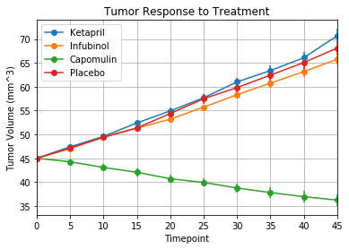

```python
import pandas as pd
import numpy as np
import matplotlib.pyplot as plt
import os
from scipy import stats
%matplotlib inline
```


```python
file1=os.path.join("raw_data","clinicaltrial_data.csv")
file2=os.path.join("raw_data","mouse_drug_data.csv")
df_clinicaltrial=pd.read_csv(file1)
df_mousedrugdata=pd.read_csv(file2)
```


```python
df_clinicaltrial.head()
```


<div>
<style scoped>
    .dataframe tbody tr th:only-of-type {
        vertical-align: middle;
    }

    .dataframe tbody tr th {
        vertical-align: top;
    }

    .dataframe thead th {
        text-align: right;
    }
</style>
<table border="1" class="dataframe">
  <thead>
    <tr style="text-align: right;">
      <th></th>
      <th>Mouse ID</th>
      <th>Timepoint</th>
      <th>Tumor Volume (mm3)</th>
      <th>Metastatic Sites</th>
    </tr>
  </thead>
  <tbody>
    <tr>
      <th>0</th>
      <td>b128</td>
      <td>0</td>
      <td>45.0</td>
      <td>0</td>
    </tr>
    <tr>
      <th>1</th>
      <td>f932</td>
      <td>0</td>
      <td>45.0</td>
      <td>0</td>
    </tr>
    <tr>
      <th>2</th>
      <td>g107</td>
      <td>0</td>
      <td>45.0</td>
      <td>0</td>
    </tr>
    <tr>
      <th>3</th>
      <td>a457</td>
      <td>0</td>
      <td>45.0</td>
      <td>0</td>
    </tr>
    <tr>
      <th>4</th>
      <td>c819</td>
      <td>0</td>
      <td>45.0</td>
      <td>0</td>
    </tr>
  </tbody>
</table>
</div>


```python
len(df_clinicaltrial)
```


    1893


```python
df_mousedrugdata.head()
```


<div>
<style scoped>
    .dataframe tbody tr th:only-of-type {
        vertical-align: middle;
    }

    .dataframe tbody tr th {
        vertical-align: top;
    }

    .dataframe thead th {
        text-align: right;
    }
</style>
<table border="1" class="dataframe">
  <thead>
    <tr style="text-align: right;">
      <th></th>
      <th>Mouse ID</th>
      <th>Drug</th>
    </tr>
  </thead>
  <tbody>
    <tr>
      <th>0</th>
      <td>f234</td>
      <td>Stelasyn</td>
    </tr>
    <tr>
      <th>1</th>
      <td>x402</td>
      <td>Stelasyn</td>
    </tr>
    <tr>
      <th>2</th>
      <td>a492</td>
      <td>Stelasyn</td>
    </tr>
    <tr>
      <th>3</th>
      <td>w540</td>
      <td>Stelasyn</td>
    </tr>
    <tr>
      <th>4</th>
      <td>v764</td>
      <td>Stelasyn</td>
    </tr>
  </tbody>
</table>
</div>


```python
len(df_mousedrugdata)
```


    250


```python
# Select data for (Capomulin, Infubinol, Ketapril, and Placebo)
df_mousedrugdata=df_mousedrugdata[(df_mousedrugdata['Drug']=="Infubinol") | (df_mousedrugdata['Drug']=="Capomulin") | (df_mousedrugdata['Drug']=="Ketapril")\
                 | (df_mousedrugdata['Drug']=="Placebo")]
df_mousedrugdata.count()
```


    Mouse ID    100
    Drug        100
    dtype: int64


```python
df_combine=pd.merge(df_mousedrugdata,df_clinicaltrial,on="Mouse ID",how="inner")
# df_combine=pd.merge(df_mousedrugdata,df_clinicaltrial,on="Mouse ID",how="left")
df_combine.count()
# df_combine.head()
```


    Mouse ID              777
    Drug                  777
    Timepoint             777
    Tumor Volume (mm3)    777
    Metastatic Sites      777
    dtype: int64


```python
df_combine.head()
```


<div>
<style scoped>
    .dataframe tbody tr th:only-of-type {
        vertical-align: middle;
    }

    .dataframe tbody tr th {
        vertical-align: top;
    }

    .dataframe thead th {
        text-align: right;
    }
</style>
<table border="1" class="dataframe">
  <thead>
    <tr style="text-align: right;">
      <th></th>
      <th>Mouse ID</th>
      <th>Drug</th>
      <th>Timepoint</th>
      <th>Tumor Volume (mm3)</th>
      <th>Metastatic Sites</th>
    </tr>
  </thead>
  <tbody>
    <tr>
      <th>0</th>
      <td>q119</td>
      <td>Ketapril</td>
      <td>0</td>
      <td>45.000000</td>
      <td>0</td>
    </tr>
    <tr>
      <th>1</th>
      <td>q119</td>
      <td>Ketapril</td>
      <td>5</td>
      <td>47.864440</td>
      <td>0</td>
    </tr>
    <tr>
      <th>2</th>
      <td>q119</td>
      <td>Ketapril</td>
      <td>10</td>
      <td>51.236606</td>
      <td>0</td>
    </tr>
    <tr>
      <th>3</th>
      <td>n923</td>
      <td>Ketapril</td>
      <td>0</td>
      <td>45.000000</td>
      <td>0</td>
    </tr>
    <tr>
      <th>4</th>
      <td>n923</td>
      <td>Ketapril</td>
      <td>5</td>
      <td>45.824881</td>
      <td>0</td>
    </tr>
  </tbody>
</table>
</div>


```python
# Grouping by Drug Name and Time Point
groupbydrug=df_combine.groupby(['Drug','Timepoint'])
tvol=groupbydrug['Tumor Volume (mm3)'].agg([np.mean])

tvol_df_resetindex=tvol.reset_index(drop=False)
tvol_df_resetindex.head()
```


<div>
<style scoped>
    .dataframe tbody tr th:only-of-type {
        vertical-align: middle;
    }

    .dataframe tbody tr th {
        vertical-align: top;
    }

    .dataframe thead th {
        text-align: right;
    }
</style>
<table border="1" class="dataframe">
  <thead>
    <tr style="text-align: right;">
      <th></th>
      <th>Drug</th>
      <th>Timepoint</th>
      <th>mean</th>
    </tr>
  </thead>
  <tbody>
    <tr>
      <th>0</th>
      <td>Capomulin</td>
      <td>0</td>
      <td>45.000000</td>
    </tr>
    <tr>
      <th>1</th>
      <td>Capomulin</td>
      <td>5</td>
      <td>44.266086</td>
    </tr>
    <tr>
      <th>2</th>
      <td>Capomulin</td>
      <td>10</td>
      <td>43.084291</td>
    </tr>
    <tr>
      <th>3</th>
      <td>Capomulin</td>
      <td>15</td>
      <td>42.064317</td>
    </tr>
    <tr>
      <th>4</th>
      <td>Capomulin</td>
      <td>20</td>
      <td>40.716325</td>
    </tr>
  </tbody>
</table>
</div>


```python
# change dataframe to columnvise
drug_list=tvol_df_resetindex['Drug'].value_counts().index.tolist()

for drug in drug_list:
    tvol_df_resetindex[drug]=tvol_df_resetindex[['mean']][tvol_df_resetindex['Drug']==drug]
tvol_df_resetindex.head(15)


```


<div>
<style scoped>
    .dataframe tbody tr th:only-of-type {
        vertical-align: middle;
    }

    .dataframe tbody tr th {
        vertical-align: top;
    }

    .dataframe thead th {
        text-align: right;
    }
</style>
<table border="1" class="dataframe">
  <thead>
    <tr style="text-align: right;">
      <th></th>
      <th>Drug</th>
      <th>Timepoint</th>
      <th>mean</th>
      <th>Infubinol</th>
      <th>Ketapril</th>
      <th>Placebo</th>
      <th>Capomulin</th>
    </tr>
  </thead>
  <tbody>
    <tr>
      <th>0</th>
      <td>Capomulin</td>
      <td>0</td>
      <td>45.000000</td>
      <td>NaN</td>
      <td>NaN</td>
      <td>NaN</td>
      <td>45.000000</td>
    </tr>
    <tr>
      <th>1</th>
      <td>Capomulin</td>
      <td>5</td>
      <td>44.266086</td>
      <td>NaN</td>
      <td>NaN</td>
      <td>NaN</td>
      <td>44.266086</td>
    </tr>
    <tr>
      <th>2</th>
      <td>Capomulin</td>
      <td>10</td>
      <td>43.084291</td>
      <td>NaN</td>
      <td>NaN</td>
      <td>NaN</td>
      <td>43.084291</td>
    </tr>
    <tr>
      <th>3</th>
      <td>Capomulin</td>
      <td>15</td>
      <td>42.064317</td>
      <td>NaN</td>
      <td>NaN</td>
      <td>NaN</td>
      <td>42.064317</td>
    </tr>
    <tr>
      <th>4</th>
      <td>Capomulin</td>
      <td>20</td>
      <td>40.716325</td>
      <td>NaN</td>
      <td>NaN</td>
      <td>NaN</td>
      <td>40.716325</td>
    </tr>
    <tr>
      <th>5</th>
      <td>Capomulin</td>
      <td>25</td>
      <td>39.939528</td>
      <td>NaN</td>
      <td>NaN</td>
      <td>NaN</td>
      <td>39.939528</td>
    </tr>
    <tr>
      <th>6</th>
      <td>Capomulin</td>
      <td>30</td>
      <td>38.769339</td>
      <td>NaN</td>
      <td>NaN</td>
      <td>NaN</td>
      <td>38.769339</td>
    </tr>
    <tr>
      <th>7</th>
      <td>Capomulin</td>
      <td>35</td>
      <td>37.816839</td>
      <td>NaN</td>
      <td>NaN</td>
      <td>NaN</td>
      <td>37.816839</td>
    </tr>
    <tr>
      <th>8</th>
      <td>Capomulin</td>
      <td>40</td>
      <td>36.958001</td>
      <td>NaN</td>
      <td>NaN</td>
      <td>NaN</td>
      <td>36.958001</td>
    </tr>
    <tr>
      <th>9</th>
      <td>Capomulin</td>
      <td>45</td>
      <td>36.236114</td>
      <td>NaN</td>
      <td>NaN</td>
      <td>NaN</td>
      <td>36.236114</td>
    </tr>
    <tr>
      <th>10</th>
      <td>Infubinol</td>
      <td>0</td>
      <td>45.000000</td>
      <td>45.000000</td>
      <td>NaN</td>
      <td>NaN</td>
      <td>NaN</td>
    </tr>
    <tr>
      <th>11</th>
      <td>Infubinol</td>
      <td>5</td>
      <td>47.062001</td>
      <td>47.062001</td>
      <td>NaN</td>
      <td>NaN</td>
      <td>NaN</td>
    </tr>
    <tr>
      <th>12</th>
      <td>Infubinol</td>
      <td>10</td>
      <td>49.403909</td>
      <td>49.403909</td>
      <td>NaN</td>
      <td>NaN</td>
      <td>NaN</td>
    </tr>
    <tr>
      <th>13</th>
      <td>Infubinol</td>
      <td>15</td>
      <td>51.296397</td>
      <td>51.296397</td>
      <td>NaN</td>
      <td>NaN</td>
      <td>NaN</td>
    </tr>
    <tr>
      <th>14</th>
      <td>Infubinol</td>
      <td>20</td>
      <td>53.197691</td>
      <td>53.197691</td>
      <td>NaN</td>
      <td>NaN</td>
      <td>NaN</td>
    </tr>
  </tbody>
</table>
</div>


```python
tumorvol_time=tvol_df_resetindex[["Timepoint","Ketapril","Infubinol","Capomulin","Placebo"]]
tumorvol_time_grouped=tumorvol_time.groupby('Timepoint')
tumorvol=tumorvol_time_grouped.agg(np.sum)
tumorvol
```


<div>
<style scoped>
    .dataframe tbody tr th:only-of-type {
        vertical-align: middle;
    }

    .dataframe tbody tr th {
        vertical-align: top;
    }

    .dataframe thead th {
        text-align: right;
    }
</style>
<table border="1" class="dataframe">
  <thead>
    <tr style="text-align: right;">
      <th></th>
      <th>Ketapril</th>
      <th>Infubinol</th>
      <th>Capomulin</th>
      <th>Placebo</th>
    </tr>
    <tr>
      <th>Timepoint</th>
      <th></th>
      <th></th>
      <th></th>
      <th></th>
    </tr>
  </thead>
  <tbody>
    <tr>
      <th>0</th>
      <td>45.000000</td>
      <td>45.000000</td>
      <td>45.000000</td>
      <td>45.000000</td>
    </tr>
    <tr>
      <th>5</th>
      <td>47.389175</td>
      <td>47.062001</td>
      <td>44.266086</td>
      <td>47.125589</td>
    </tr>
    <tr>
      <th>10</th>
      <td>49.582269</td>
      <td>49.403909</td>
      <td>43.084291</td>
      <td>49.423329</td>
    </tr>
    <tr>
      <th>15</th>
      <td>52.399974</td>
      <td>51.296397</td>
      <td>42.064317</td>
      <td>51.359742</td>
    </tr>
    <tr>
      <th>20</th>
      <td>54.920935</td>
      <td>53.197691</td>
      <td>40.716325</td>
      <td>54.364417</td>
    </tr>
    <tr>
      <th>25</th>
      <td>57.678982</td>
      <td>55.715252</td>
      <td>39.939528</td>
      <td>57.482574</td>
    </tr>
    <tr>
      <th>30</th>
      <td>60.994507</td>
      <td>58.299397</td>
      <td>38.769339</td>
      <td>59.809063</td>
    </tr>
    <tr>
      <th>35</th>
      <td>63.371686</td>
      <td>60.742461</td>
      <td>37.816839</td>
      <td>62.420615</td>
    </tr>
    <tr>
      <th>40</th>
      <td>66.068580</td>
      <td>63.162824</td>
      <td>36.958001</td>
      <td>65.052675</td>
    </tr>
    <tr>
      <th>45</th>
      <td>70.662958</td>
      <td>65.755562</td>
      <td>36.236114</td>
      <td>68.084082</td>
    </tr>
  </tbody>
</table>
</div>


```python
# calculate SEM
df_grp=df_combine.groupby(['Drug','Timepoint'])
sem=df_grp['Tumor Volume (mm3)'].agg(stats.sem)
s1=sem.reset_index(drop=False)

for drug in drug_list:
    s1[drug]=s1[['Tumor Volume (mm3)']][s1['Drug']==drug]

sem_grped=s1.groupby('Timepoint')
sem1_=sem_grped.agg(np.mean)
sem1=sem1_.drop(['Tumor Volume (mm3)'],axis=1)
```


```python
sem1
```


<div>
<style scoped>
    .dataframe tbody tr th:only-of-type {
        vertical-align: middle;
    }

    .dataframe tbody tr th {
        vertical-align: top;
    }

    .dataframe thead th {
        text-align: right;
    }
</style>
<table border="1" class="dataframe">
  <thead>
    <tr style="text-align: right;">
      <th></th>
      <th>Infubinol</th>
      <th>Ketapril</th>
      <th>Placebo</th>
      <th>Capomulin</th>
    </tr>
    <tr>
      <th>Timepoint</th>
      <th></th>
      <th></th>
      <th></th>
      <th></th>
    </tr>
  </thead>
  <tbody>
    <tr>
      <th>0</th>
      <td>0.000000</td>
      <td>0.000000</td>
      <td>0.000000</td>
      <td>0.000000</td>
    </tr>
    <tr>
      <th>5</th>
      <td>0.235102</td>
      <td>0.264819</td>
      <td>0.218091</td>
      <td>0.448593</td>
    </tr>
    <tr>
      <th>10</th>
      <td>0.282346</td>
      <td>0.357421</td>
      <td>0.402064</td>
      <td>0.702684</td>
    </tr>
    <tr>
      <th>15</th>
      <td>0.357705</td>
      <td>0.580268</td>
      <td>0.614461</td>
      <td>0.838617</td>
    </tr>
    <tr>
      <th>20</th>
      <td>0.476210</td>
      <td>0.726484</td>
      <td>0.839609</td>
      <td>0.909731</td>
    </tr>
    <tr>
      <th>25</th>
      <td>0.550315</td>
      <td>0.755413</td>
      <td>1.034872</td>
      <td>0.881642</td>
    </tr>
    <tr>
      <th>30</th>
      <td>0.631061</td>
      <td>0.934121</td>
      <td>1.218231</td>
      <td>0.934460</td>
    </tr>
    <tr>
      <th>35</th>
      <td>0.984155</td>
      <td>1.127867</td>
      <td>1.287481</td>
      <td>1.052241</td>
    </tr>
    <tr>
      <th>40</th>
      <td>1.055220</td>
      <td>1.158449</td>
      <td>1.370634</td>
      <td>1.223608</td>
    </tr>
    <tr>
      <th>45</th>
      <td>1.144427</td>
      <td>1.453186</td>
      <td>1.351726</td>
      <td>1.223977</td>
    </tr>
  </tbody>
</table>
</div>


# Tumor Response to Treatment


```python
# Make scatter plot in pandas
tumorvol.plot(yerr=sem1,marker='o')
plt.title('Tumor Response to Treatment')
plt.ylabel('Tumor Volume (mm^3)')
plt.xlim(0,45)

plt.grid()
```





# Observations
1. Only Capomuline is effective in terms of reducing the volume of tumor.


```python
# Calculate metastatic sites change overtime

df_combine.head()
df_combine_=df_combine.drop(['Mouse ID','Tumor Volume (mm3)'],1)
df_combine_.head()
```


<div>
<style scoped>
    .dataframe tbody tr th:only-of-type {
        vertical-align: middle;
    }

    .dataframe tbody tr th {
        vertical-align: top;
    }

    .dataframe thead th {
        text-align: right;
    }
</style>
<table border="1" class="dataframe">
  <thead>
    <tr style="text-align: right;">
      <th></th>
      <th>Drug</th>
      <th>Timepoint</th>
      <th>Metastatic Sites</th>
    </tr>
  </thead>
  <tbody>
    <tr>
      <th>0</th>
      <td>Ketapril</td>
      <td>0</td>
      <td>0</td>
    </tr>
    <tr>
      <th>1</th>
      <td>Ketapril</td>
      <td>5</td>
      <td>0</td>
    </tr>
    <tr>
      <th>2</th>
      <td>Ketapril</td>
      <td>10</td>
      <td>0</td>
    </tr>
    <tr>
      <th>3</th>
      <td>Ketapril</td>
      <td>0</td>
      <td>0</td>
    </tr>
    <tr>
      <th>4</th>
      <td>Ketapril</td>
      <td>5</td>
      <td>0</td>
    </tr>
  </tbody>
</table>
</div>


```python
grped=df_combine_.groupby(["Drug","Timepoint"])
df_metsites=grped[['Metastatic Sites']].agg(np.mean)
df_metsites1=df_metsites.reset_index(drop=False)
df_metsites1.head()
```


<div>
<style scoped>
    .dataframe tbody tr th:only-of-type {
        vertical-align: middle;
    }

    .dataframe tbody tr th {
        vertical-align: top;
    }

    .dataframe thead th {
        text-align: right;
    }
</style>
<table border="1" class="dataframe">
  <thead>
    <tr style="text-align: right;">
      <th></th>
      <th>Drug</th>
      <th>Timepoint</th>
      <th>Metastatic Sites</th>
    </tr>
  </thead>
  <tbody>
    <tr>
      <th>0</th>
      <td>Capomulin</td>
      <td>0</td>
      <td>0.000000</td>
    </tr>
    <tr>
      <th>1</th>
      <td>Capomulin</td>
      <td>5</td>
      <td>0.160000</td>
    </tr>
    <tr>
      <th>2</th>
      <td>Capomulin</td>
      <td>10</td>
      <td>0.320000</td>
    </tr>
    <tr>
      <th>3</th>
      <td>Capomulin</td>
      <td>15</td>
      <td>0.375000</td>
    </tr>
    <tr>
      <th>4</th>
      <td>Capomulin</td>
      <td>20</td>
      <td>0.652174</td>
    </tr>
  </tbody>
</table>
</div>


```python
for drug in drug_list:
    df_metsites1[drug]=df_metsites1[['Metastatic Sites']][df_metsites1['Drug']==drug]
df_metsites1.head()
```


<div>
<style scoped>
    .dataframe tbody tr th:only-of-type {
        vertical-align: middle;
    }

    .dataframe tbody tr th {
        vertical-align: top;
    }

    .dataframe thead th {
        text-align: right;
    }
</style>
<table border="1" class="dataframe">
  <thead>
    <tr style="text-align: right;">
      <th></th>
      <th>Drug</th>
      <th>Timepoint</th>
      <th>Metastatic Sites</th>
      <th>Infubinol</th>
      <th>Ketapril</th>
      <th>Placebo</th>
      <th>Capomulin</th>
    </tr>
  </thead>
  <tbody>
    <tr>
      <th>0</th>
      <td>Capomulin</td>
      <td>0</td>
      <td>0.000000</td>
      <td>NaN</td>
      <td>NaN</td>
      <td>NaN</td>
      <td>0.000000</td>
    </tr>
    <tr>
      <th>1</th>
      <td>Capomulin</td>
      <td>5</td>
      <td>0.160000</td>
      <td>NaN</td>
      <td>NaN</td>
      <td>NaN</td>
      <td>0.160000</td>
    </tr>
    <tr>
      <th>2</th>
      <td>Capomulin</td>
      <td>10</td>
      <td>0.320000</td>
      <td>NaN</td>
      <td>NaN</td>
      <td>NaN</td>
      <td>0.320000</td>
    </tr>
    <tr>
      <th>3</th>
      <td>Capomulin</td>
      <td>15</td>
      <td>0.375000</td>
      <td>NaN</td>
      <td>NaN</td>
      <td>NaN</td>
      <td>0.375000</td>
    </tr>
    <tr>
      <th>4</th>
      <td>Capomulin</td>
      <td>20</td>
      <td>0.652174</td>
      <td>NaN</td>
      <td>NaN</td>
      <td>NaN</td>
      <td>0.652174</td>
    </tr>
  </tbody>
</table>
</div>


```python
# help(pd.DataFrame.drop)
```


```python
df_metsites1_=df_metsites1.drop(['Metastatic Sites'],axis=1)
df_metsites1_grped=df_metsites1_.groupby('Timepoint')
df_metsites2=df_metsites1_grped.agg(np.sum)
df_metsites2
# df_combine_=df_combine.drop(['Mouse ID','Tumor Volume (mm3)'],1)

```


<div>
<style scoped>
    .dataframe tbody tr th:only-of-type {
        vertical-align: middle;
    }

    .dataframe tbody tr th {
        vertical-align: top;
    }

    .dataframe thead th {
        text-align: right;
    }
</style>
<table border="1" class="dataframe">
  <thead>
    <tr style="text-align: right;">
      <th></th>
      <th>Infubinol</th>
      <th>Ketapril</th>
      <th>Placebo</th>
      <th>Capomulin</th>
    </tr>
    <tr>
      <th>Timepoint</th>
      <th></th>
      <th></th>
      <th></th>
      <th></th>
    </tr>
  </thead>
  <tbody>
    <tr>
      <th>0</th>
      <td>0.000000</td>
      <td>0.000000</td>
      <td>0.000000</td>
      <td>0.000000</td>
    </tr>
    <tr>
      <th>5</th>
      <td>0.280000</td>
      <td>0.304348</td>
      <td>0.375000</td>
      <td>0.160000</td>
    </tr>
    <tr>
      <th>10</th>
      <td>0.666667</td>
      <td>0.590909</td>
      <td>0.833333</td>
      <td>0.320000</td>
    </tr>
    <tr>
      <th>15</th>
      <td>0.904762</td>
      <td>0.842105</td>
      <td>1.250000</td>
      <td>0.375000</td>
    </tr>
    <tr>
      <th>20</th>
      <td>1.050000</td>
      <td>1.210526</td>
      <td>1.526316</td>
      <td>0.652174</td>
    </tr>
    <tr>
      <th>25</th>
      <td>1.277778</td>
      <td>1.631579</td>
      <td>1.941176</td>
      <td>0.818182</td>
    </tr>
    <tr>
      <th>30</th>
      <td>1.588235</td>
      <td>2.055556</td>
      <td>2.266667</td>
      <td>1.090909</td>
    </tr>
    <tr>
      <th>35</th>
      <td>1.666667</td>
      <td>2.294118</td>
      <td>2.642857</td>
      <td>1.181818</td>
    </tr>
    <tr>
      <th>40</th>
      <td>2.100000</td>
      <td>2.733333</td>
      <td>3.166667</td>
      <td>1.380952</td>
    </tr>
    <tr>
      <th>45</th>
      <td>2.111111</td>
      <td>3.363636</td>
      <td>3.272727</td>
      <td>1.476190</td>
    </tr>
  </tbody>
</table>
</div>


```python
# Calculate SEMs of Metastatic sites change data
sem_metsites=grped[['Metastatic Sites']].agg(stats.sem)
sem_metsites1=sem_metsites.reset_index(drop=False)

for drug in drug_list:
    sem_metsites1[drug]=sem_metsites1['Metastatic Sites'][sem_metsites1['Drug']==drug]
sem_metsites1_=sem_metsites1.drop(['Drug','Metastatic Sites'],axis=1)
sem_grped1=sem_metsites1_.groupby('Timepoint')
sem_metsites2=sem_grped1.agg(np.mean)
```


```python
sem_metsites2
```


<div>
<style scoped>
    .dataframe tbody tr th:only-of-type {
        vertical-align: middle;
    }

    .dataframe tbody tr th {
        vertical-align: top;
    }

    .dataframe thead th {
        text-align: right;
    }
</style>
<table border="1" class="dataframe">
  <thead>
    <tr style="text-align: right;">
      <th></th>
      <th>Infubinol</th>
      <th>Ketapril</th>
      <th>Placebo</th>
      <th>Capomulin</th>
    </tr>
    <tr>
      <th>Timepoint</th>
      <th></th>
      <th></th>
      <th></th>
      <th></th>
    </tr>
  </thead>
  <tbody>
    <tr>
      <th>0</th>
      <td>0.000000</td>
      <td>0.000000</td>
      <td>0.000000</td>
      <td>0.000000</td>
    </tr>
    <tr>
      <th>5</th>
      <td>0.091652</td>
      <td>0.098100</td>
      <td>0.100947</td>
      <td>0.074833</td>
    </tr>
    <tr>
      <th>10</th>
      <td>0.159364</td>
      <td>0.142018</td>
      <td>0.115261</td>
      <td>0.125433</td>
    </tr>
    <tr>
      <th>15</th>
      <td>0.194015</td>
      <td>0.191381</td>
      <td>0.190221</td>
      <td>0.132048</td>
    </tr>
    <tr>
      <th>20</th>
      <td>0.234801</td>
      <td>0.236680</td>
      <td>0.234064</td>
      <td>0.161621</td>
    </tr>
    <tr>
      <th>25</th>
      <td>0.265753</td>
      <td>0.288275</td>
      <td>0.263888</td>
      <td>0.181818</td>
    </tr>
    <tr>
      <th>30</th>
      <td>0.227823</td>
      <td>0.347467</td>
      <td>0.300264</td>
      <td>0.172944</td>
    </tr>
    <tr>
      <th>35</th>
      <td>0.224733</td>
      <td>0.361418</td>
      <td>0.341412</td>
      <td>0.169496</td>
    </tr>
    <tr>
      <th>40</th>
      <td>0.314466</td>
      <td>0.315725</td>
      <td>0.297294</td>
      <td>0.175610</td>
    </tr>
    <tr>
      <th>45</th>
      <td>0.309320</td>
      <td>0.278722</td>
      <td>0.304240</td>
      <td>0.202591</td>
    </tr>
  </tbody>
</table>
</div>


# Metastatic Spread During Treatment


```python
#Creating a scatter plot that shows how the number of metastatic (cancer spreading) sites changes over time for each treatment
df_metsites2.plot(yerr=sem_metsites2,marker="^")
plt.ylabel("Metastatic Sites")
plt.title("Metastatic Spread during Treatment")
plt.xlabel("Timepoint (Days)")
plt.grid()
plt.xlim(0,45)

```


    (0, 45)


# Observation
1. Capomuline is most effective in terms of having least spread of metastatic sites.

#Creating a scatter plot that shows the number of mice still alive through the course of treatment (Survival Rate)


```python
df_combine.head()
```


<div>
<style scoped>
    .dataframe tbody tr th:only-of-type {
        vertical-align: middle;
    }

    .dataframe tbody tr th {
        vertical-align: top;
    }

    .dataframe thead th {
        text-align: right;
    }
</style>
<table border="1" class="dataframe">
  <thead>
    <tr style="text-align: right;">
      <th></th>
      <th>Mouse ID</th>
      <th>Drug</th>
      <th>Timepoint</th>
      <th>Tumor Volume (mm3)</th>
      <th>Metastatic Sites</th>
    </tr>
  </thead>
  <tbody>
    <tr>
      <th>0</th>
      <td>q119</td>
      <td>Ketapril</td>
      <td>0</td>
      <td>45.000000</td>
      <td>0</td>
    </tr>
    <tr>
      <th>1</th>
      <td>q119</td>
      <td>Ketapril</td>
      <td>5</td>
      <td>47.864440</td>
      <td>0</td>
    </tr>
    <tr>
      <th>2</th>
      <td>q119</td>
      <td>Ketapril</td>
      <td>10</td>
      <td>51.236606</td>
      <td>0</td>
    </tr>
    <tr>
      <th>3</th>
      <td>n923</td>
      <td>Ketapril</td>
      <td>0</td>
      <td>45.000000</td>
      <td>0</td>
    </tr>
    <tr>
      <th>4</th>
      <td>n923</td>
      <td>Ketapril</td>
      <td>5</td>
      <td>45.824881</td>
      <td>0</td>
    </tr>
  </tbody>
</table>
</div>


```python
grped_micelife=df_combine.groupby('Drug')
count_timepoint=grped_micelife['Timepoint'].value_counts()
count_timepoint_df=count_timepoint.to_frame()
count_timepoint_df1=count_timepoint_df.rename(columns={"Timepoint":"Measurement Count"})
count_timepoint_df2=count_timepoint_df1.reset_index(drop=False)
count_timepoint_df2['Survival Rate']=count_timepoint_df2['Measurement Count']/25*100
count_timepoint_df2.head()
```


<div>
<style scoped>
    .dataframe tbody tr th:only-of-type {
        vertical-align: middle;
    }

    .dataframe tbody tr th {
        vertical-align: top;
    }

    .dataframe thead th {
        text-align: right;
    }
</style>
<table border="1" class="dataframe">
  <thead>
    <tr style="text-align: right;">
      <th></th>
      <th>Drug</th>
      <th>Timepoint</th>
      <th>Measurement Count</th>
      <th>Survival Rate</th>
    </tr>
  </thead>
  <tbody>
    <tr>
      <th>0</th>
      <td>Capomulin</td>
      <td>0</td>
      <td>25</td>
      <td>100.0</td>
    </tr>
    <tr>
      <th>1</th>
      <td>Capomulin</td>
      <td>5</td>
      <td>25</td>
      <td>100.0</td>
    </tr>
    <tr>
      <th>2</th>
      <td>Capomulin</td>
      <td>10</td>
      <td>25</td>
      <td>100.0</td>
    </tr>
    <tr>
      <th>3</th>
      <td>Capomulin</td>
      <td>15</td>
      <td>24</td>
      <td>96.0</td>
    </tr>
    <tr>
      <th>4</th>
      <td>Capomulin</td>
      <td>20</td>
      <td>23</td>
      <td>92.0</td>
    </tr>
  </tbody>
</table>
</div>


```python
for drug in drug_list:
    count_timepoint_df2[drug]=count_timepoint_df2['Survival Rate'][count_timepoint_df2['Drug']==drug]
count_timepoint_df3=count_timepoint_df2.drop(["Drug","Measurement Count","Survival Rate"],axis=1)
count_timepoint_grped=count_timepoint_df3.groupby('Timepoint')
count_timepoint_df4=count_timepoint_grped.agg(np.mean)
```


```python
count_timepoint_df4
```


<div>
<style scoped>
    .dataframe tbody tr th:only-of-type {
        vertical-align: middle;
    }

    .dataframe tbody tr th {
        vertical-align: top;
    }

    .dataframe thead th {
        text-align: right;
    }
</style>
<table border="1" class="dataframe">
  <thead>
    <tr style="text-align: right;">
      <th></th>
      <th>Infubinol</th>
      <th>Ketapril</th>
      <th>Placebo</th>
      <th>Capomulin</th>
    </tr>
    <tr>
      <th>Timepoint</th>
      <th></th>
      <th></th>
      <th></th>
      <th></th>
    </tr>
  </thead>
  <tbody>
    <tr>
      <th>0</th>
      <td>100.0</td>
      <td>100.0</td>
      <td>100.0</td>
      <td>100.0</td>
    </tr>
    <tr>
      <th>5</th>
      <td>100.0</td>
      <td>92.0</td>
      <td>96.0</td>
      <td>100.0</td>
    </tr>
    <tr>
      <th>10</th>
      <td>84.0</td>
      <td>88.0</td>
      <td>96.0</td>
      <td>100.0</td>
    </tr>
    <tr>
      <th>15</th>
      <td>84.0</td>
      <td>76.0</td>
      <td>80.0</td>
      <td>96.0</td>
    </tr>
    <tr>
      <th>20</th>
      <td>80.0</td>
      <td>76.0</td>
      <td>76.0</td>
      <td>92.0</td>
    </tr>
    <tr>
      <th>25</th>
      <td>72.0</td>
      <td>76.0</td>
      <td>68.0</td>
      <td>88.0</td>
    </tr>
    <tr>
      <th>30</th>
      <td>68.0</td>
      <td>72.0</td>
      <td>60.0</td>
      <td>88.0</td>
    </tr>
    <tr>
      <th>35</th>
      <td>48.0</td>
      <td>68.0</td>
      <td>56.0</td>
      <td>88.0</td>
    </tr>
    <tr>
      <th>40</th>
      <td>40.0</td>
      <td>60.0</td>
      <td>48.0</td>
      <td>84.0</td>
    </tr>
    <tr>
      <th>45</th>
      <td>36.0</td>
      <td>44.0</td>
      <td>44.0</td>
      <td>84.0</td>
    </tr>
  </tbody>
</table>
</div>


# Survival During Treatment


```python
count_timepoint_df4.plot(marker='o')
plt.title('Survival During Treatment')
plt.xlabel('Time (Days)')
plt.ylabel('Survival Rate (%)')
plt.grid(linestyle='-.', linewidth=.5)
plt.xlim(0,45)
```


    (0, 45)


# Observation
1. Capomuline has highest survival rate


```python
# Creating a bar graph that compares the total % tumor volume change for each drug across the full 45 days.
tumorvol
```


<div>
<style scoped>
    .dataframe tbody tr th:only-of-type {
        vertical-align: middle;
    }

    .dataframe tbody tr th {
        vertical-align: top;
    }

    .dataframe thead th {
        text-align: right;
    }
</style>
<table border="1" class="dataframe">
  <thead>
    <tr style="text-align: right;">
      <th></th>
      <th>Ketapril</th>
      <th>Infubinol</th>
      <th>Capomulin</th>
      <th>Placebo</th>
    </tr>
    <tr>
      <th>Timepoint</th>
      <th></th>
      <th></th>
      <th></th>
      <th></th>
    </tr>
  </thead>
  <tbody>
    <tr>
      <th>0</th>
      <td>45.000000</td>
      <td>45.000000</td>
      <td>45.000000</td>
      <td>45.000000</td>
    </tr>
    <tr>
      <th>5</th>
      <td>47.389175</td>
      <td>47.062001</td>
      <td>44.266086</td>
      <td>47.125589</td>
    </tr>
    <tr>
      <th>10</th>
      <td>49.582269</td>
      <td>49.403909</td>
      <td>43.084291</td>
      <td>49.423329</td>
    </tr>
    <tr>
      <th>15</th>
      <td>52.399974</td>
      <td>51.296397</td>
      <td>42.064317</td>
      <td>51.359742</td>
    </tr>
    <tr>
      <th>20</th>
      <td>54.920935</td>
      <td>53.197691</td>
      <td>40.716325</td>
      <td>54.364417</td>
    </tr>
    <tr>
      <th>25</th>
      <td>57.678982</td>
      <td>55.715252</td>
      <td>39.939528</td>
      <td>57.482574</td>
    </tr>
    <tr>
      <th>30</th>
      <td>60.994507</td>
      <td>58.299397</td>
      <td>38.769339</td>
      <td>59.809063</td>
    </tr>
    <tr>
      <th>35</th>
      <td>63.371686</td>
      <td>60.742461</td>
      <td>37.816839</td>
      <td>62.420615</td>
    </tr>
    <tr>
      <th>40</th>
      <td>66.068580</td>
      <td>63.162824</td>
      <td>36.958001</td>
      <td>65.052675</td>
    </tr>
    <tr>
      <th>45</th>
      <td>70.662958</td>
      <td>65.755562</td>
      <td>36.236114</td>
      <td>68.084082</td>
    </tr>
  </tbody>
</table>
</div>


```python
tumour_volume_change=[]
for drug in drug_list:
    tumour_volume_change.append((tumorvol.at[45, drug]/45*100)-100)
tumour_volume_change

```


    [46.123471727851864, 57.02879468660606, 51.29796048315151, -19.47530266789417]


```python
help(plt.bar)
```

    Help on function bar in module matplotlib.pyplot:
    
    bar(*args, **kwargs)
        Make a bar plot.
        
        Call signatures::
        
           bar(x, height, *, align='center', **kwargs)
           bar(x, height, width, *, align='center', **kwargs)
           bar(x, height, width, bottom, *, align='center', **kwargs)
        
        The bars are positioned at *x* with the given *align* ment. Their
        dimensions are given by *width* and *height*. The vertical baseline
        is *bottom* (default 0).
        
        Each of *x*, *height*, *width*, and *bottom* may either be a scalar
        applying to all bars, or it may be a sequence of length N providing a
        separate value for each bar.
        
        
        Parameters
        ----------
        x : sequence of scalars
            The x coordinates of the bars. See also *align* for the
            alignment of the bars to the coordinates.
        
        height : scalar or sequence of scalars
            The height(s) of the bars.
        
        width : scalar or array-like, optional
            The width(s) of the bars (default: 0.8).
        
        bottom : scalar or array-like, optional
            The y coordinate(s) of the bars bases (default: 0).
        
        align : {'center', 'edge'}, optional, default: 'center'
            Alignment of the bars to the *x* coordinates:
        
            - 'center': Center the base on the *x* positions.
            - 'edge': Align the left edges of the bars with the *x* positions.
        
            To align the bars on the right edge pass a negative *width* and
            ``align='edge'``.
        
        Returns
        -------
        `.BarContainer`
            Container with all the bars and optionally errorbars.
        
        Other Parameters
        ----------------
        color : scalar or array-like, optional
            The colors of the bar faces.
        
        edgecolor : scalar or array-like, optional
            The colors of the bar edges.
        
        linewidth : scalar or array-like, optional
            Width of the bar edge(s). If 0, don't draw edges.
        
        tick_label : string or array-like, optional
            The tick labels of the bars.
            Default: None (Use default numeric labels.)
        
        xerr, yerr : scalar or array-like of shape(N,) or shape(2,N), optional
            If not *None*, add horizontal / vertical errorbars to the bar tips.
            The values are +/- sizes relative to the data:
        
            - scalar: symmetric +/- values for all bars
            - shape(N,): symmetric +/- values for each bar
            - shape(2,N): separate + and - values for each bar
        
            Default: None
        
        ecolor : scalar or array-like, optional, default: 'black'
            The line color of the errorbars.
        
        capsize : scalar, optional
           The length of the error bar caps in points.
           Default: None, which will take the value from
           :rc:`errorbar.capsize`.
        
        error_kw : dict, optional
            Dictionary of kwargs to be passed to the `~.Axes.errorbar`
            method. Values of *ecolor* or *capsize* defined here take
            precedence over the independent kwargs.
        
        log : bool, optional, default: False
            If *True*, set the y-axis to be log scale.
        
        orientation : {'vertical',  'horizontal'}, optional
            *This is for internal use only.* Please use `barh` for
            horizontal bar plots. Default: 'vertical'.
        
        See also
        --------
        barh: Plot a horizontal bar plot.
        
        Notes
        -----
        The optional arguments *color*, *edgecolor*, *linewidth*,
        *xerr*, and *yerr* can be either scalars or sequences of
        length equal to the number of bars.  This enables you to use
        bar as the basis for stacked bar charts, or candlestick plots.
        Detail: *xerr* and *yerr* are passed directly to
        :meth:`errorbar`, so they can also have shape 2xN for
        independent specification of lower and upper errors.
        
        Other optional kwargs:
        
          agg_filter: a filter function, which takes a (m, n, 3) float array and a dpi value, and returns a (m, n, 3) array 
          alpha: float or None 
          animated: bool 
          antialiased or aa: bool or None 
          capstyle: ['butt' | 'round' | 'projecting'] 
          clip_box: a `.Bbox` instance 
          clip_on: bool 
          clip_path: [(`~matplotlib.path.Path`, `.Transform`) | `.Patch` | None] 
          color: matplotlib color spec
          contains: a callable function 
          edgecolor or ec: mpl color spec, None, 'none', or 'auto' 
          facecolor or fc: mpl color spec, or None for default, or 'none' for no color 
          figure: a `.Figure` instance 
          fill: bool 
          gid: an id string 
          hatch: ['/' | '\\' | '|' | '-' | '+' | 'x' | 'o' | 'O' | '.' | '*'] 
          joinstyle: ['miter' | 'round' | 'bevel'] 
          label: object 
          linestyle or ls: ['solid' | 'dashed', 'dashdot', 'dotted' | (offset, on-off-dash-seq) | ``'-'`` | ``'--'`` | ``'-.'`` | ``':'`` | ``'None'`` | ``' '`` | ``''``]
          linewidth or lw: float or None for default 
          path_effects: `.AbstractPathEffect` 
          picker: [None | bool | float | callable] 
          rasterized: bool or None 
          sketch_params: (scale: float, length: float, randomness: float) 
          snap: bool or None 
          transform: `.Transform` 
          url: a url string 
          visible: bool 
          zorder: float 
        
        .. note::
            In addition to the above described arguments, this function can take a
            **data** keyword argument. If such a **data** argument is given, the
            following arguments are replaced by **data[<arg>]**:
        
            * All arguments with the following names: 'bottom', 'color', 'ecolor', 'edgecolor', 'height', 'left', 'linewidth', 'tick_label', 'width', 'x', 'xerr', 'y', 'yerr'.
            * All positional arguments.
    
    

# % Tumour Change over 45 Days Treatment


```python
x_axis=np.arange(0,len(drug_list))
tick_locations=[value-.4 for value in x_axis]
plt.bar(x_axis,tumour_volume_change,color=['red', 'red', 'red', 'green'],edgecolor='black',alpha=1,align="center")
plt.xticks(tick_locations,drug_list,rotation="0")
plt.ylabel('% Change in Tumour Volume')
plt.ylim(-20,60)
plt.title('Tumour Change over 45 Day Treatment')
plt.grid(linestyle='-.',linewidth=0.5,color='black',alpha=.25,axis='y')

# setting y axis tick intervals
major_ticks=np.arange(-20,80,20)
plt.yticks(major_ticks)

# dark line at x-axis
plt.axhline(linewidth=1, color='black')

plt.tight_layout()

```


# Observations
1. Capomulin treatment results in almost 20% reduction in tumour volume.
